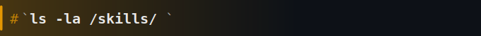

### Kamal Akhter
`Security Researcher` | `Threat Hunter` | `CTF Player`

I am a final-year Cybersecurity student with hands-on experience in security research, threat hunting, and OSINT. I actively map external attack surfaces, detect phishing infrastructure, hunt for logic flaws, and build tools that automate the boring parts of recon.

**Bounty Focus**: hunting business logic flaws and hardcoded credentials 
**Current Shell**: Threat Hunter Intern @ Techowl Infosec Pvt. 
**Active Focus**: EASM, phishing infra detection, black-box web assessments 
**Recent Milestones**: Runner-Up ISEA Hackathon | Top 6 Hac'KP | multiple valid bug bounty reports 

**[AndroNet](https://github.com/Akhter313/AndroNet)**: A dual-mode mobile packet analyzer built for Kali NetHunter, capturing real-time traffic from rooted and unrooted environments. 
**[ReconOrchestrator](https://github.com/Akhter313/ReconOrchestrator)**: A controlled concurrency engine for web application fuzzing. Built with automated rate-limiting and exponential backoff to dynamically bypass cloud protection layers. 
**[AI Digital Forensics Suite](https://github.com/Akhter313/HacKP-2025_AI)**: A collection of AI-driven investigative tools built for Hac'KP 2025. Features include image metadata analysis, search images with text, and similarity scoring. 

**Security Tools**: Burp Suite, Metasploit, Nmap, Wireshark, Nessus, Kali Linux, Splunk, Wazuh, Amass, Subfinder, httpx, ffuf 
**Security Concepts**: Web Application Security, Threat Modeling, External Attack Surface Management (EASM), OWASP Top 10 
**Networking & Protocols**: TCP/IP, DNS, HTTP/S, TLS/SSL, ICMP, Packet Analysis, VPNs 
**Programming & Scripting**: Python, Bash 

**LinkedIn**: [linkedin.com/in/313-akhter](https://www.linkedin.com/in/313-akhter/) 
**Email**: [akhterkamal815@gmail.com](mailto:akhterkamal815@gmail.com)
